# DIAGRAMAS DE ARQUITETURA E MODELO DE DADOS
## Sistema Avançado de Treino, Performance e Evolução Física

---

## 1. MODELO ENTIDADE-RELACIONAMENTO (ER)

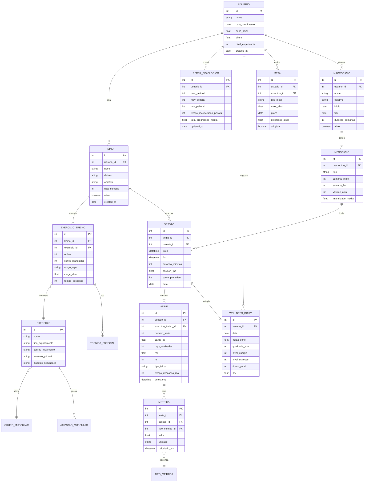

---

## 2. DIAGRAMA DE CLASSES - CORE DOMAIN

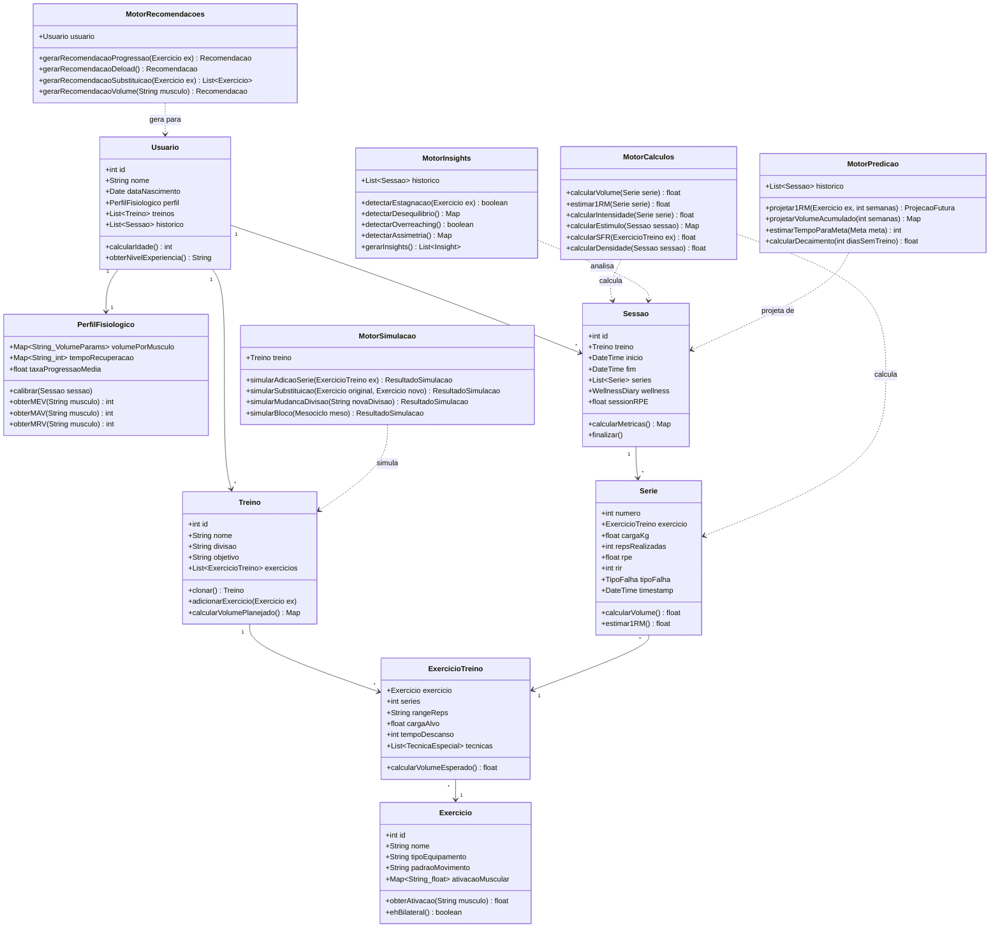

---

## 3. ARQUITETURA DE CAMADAS

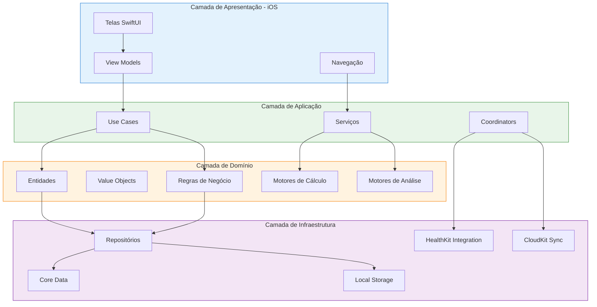

---

## 4. FLUXO DE DADOS - EXECUÇÃO DE TREINO

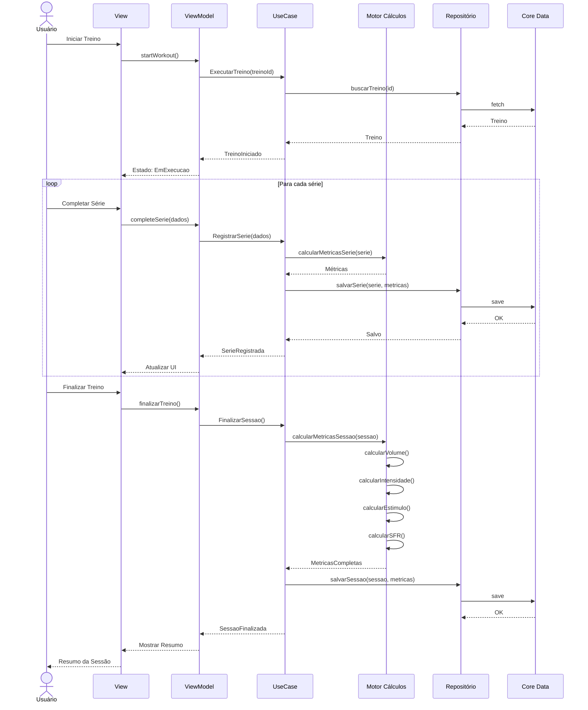

---

## 5. PIPELINE DE PROCESSAMENTO ASSÍNCRONO

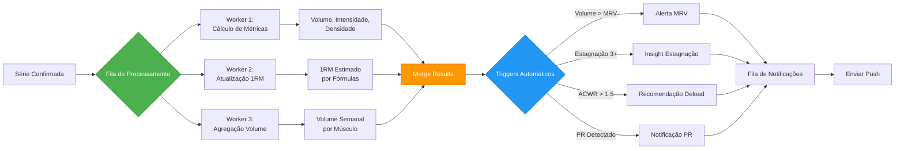

---

## 6. MODELO DE CACHE E SINCRONIZAÇÃO

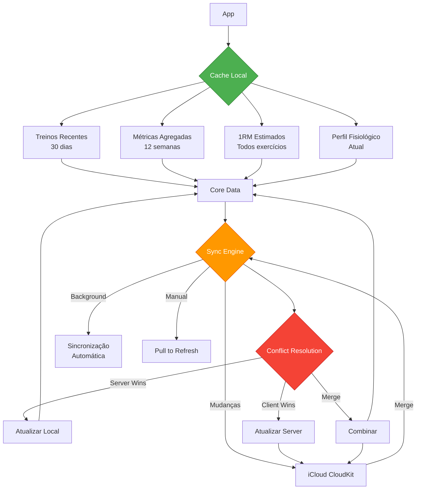

---

## 7. ARQUITETURA DE ANÁLISE E INSIGHTS

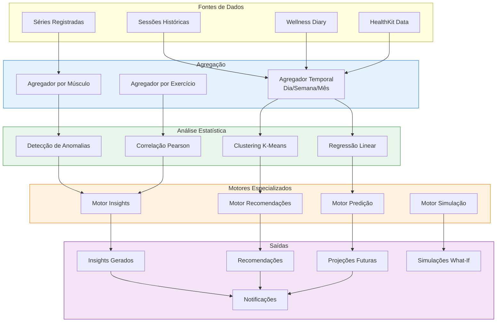

---

## 8. MODELO DE PERMISSÕES E INTEGRAÇÕES

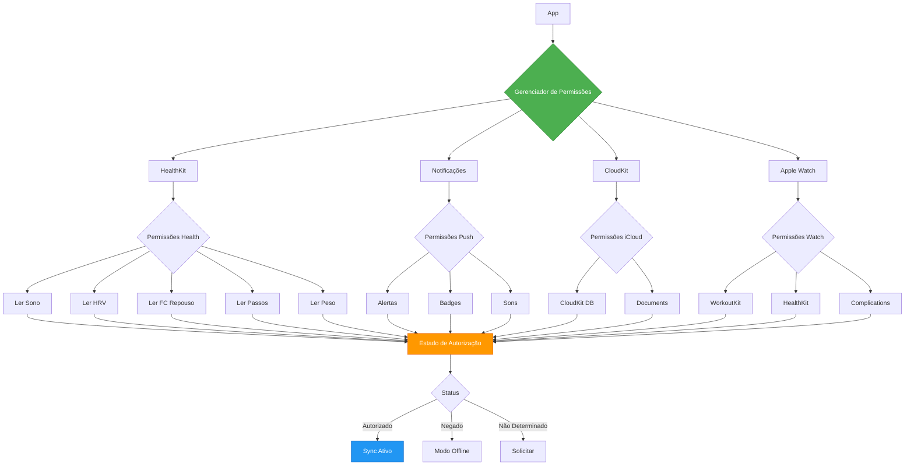

---

## 9. DIAGRAMA DE DEPENDÊNCIAS - MÓDULOS

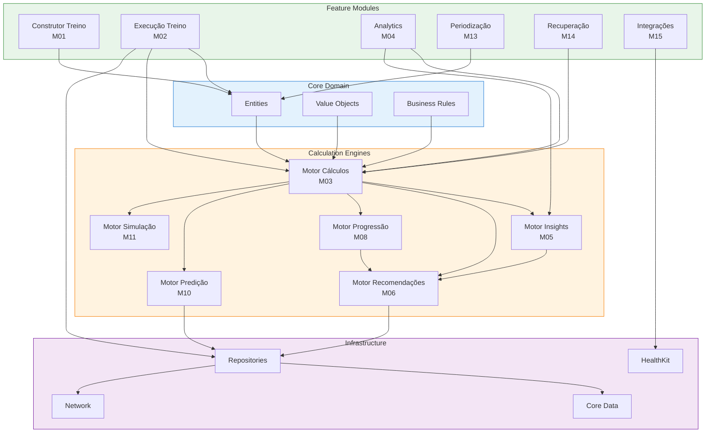

---

## 10. FLUXO DE BACKUP E RESTAURAÇÃO

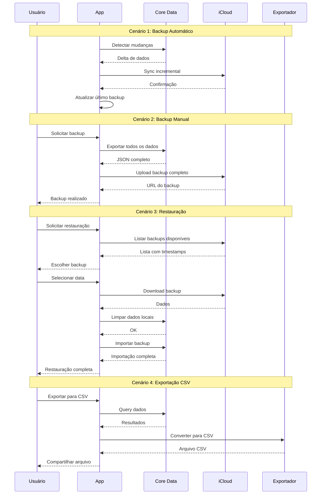

---

## 11. ESTRUTURA DE PASTAS - CÓDIGO

```
TrainingApp/
├── App/
│   ├── TrainingApp.swift
│   ├── AppDelegate.swift
│   └── SceneDelegate.swift
│
├── Core/
│   ├── Domain/
│   │   ├── Entities/
│   │   │   ├── Usuario.swift
│   │   │   ├── Treino.swift
│   │   │   ├── Exercicio.swift
│   │   │   ├── Sessao.swift
│   │   │   └── Serie.swift
│   │   ├── ValueObjects/
│   │   │   ├── RPE.swift
│   │   │   ├── RIR.swift
│   │   │   └── VolumeParams.swift
│   │   └── BusinessRules/
│   │       ├── ProgressionRules.swift
│   │       └── ValidationRules.swift
│   │
│   ├── Application/
│   │   ├── UseCases/
│   │   │   ├── ExecutarTreino.swift
│   │   │   ├── RegistrarSerie.swift
│   │   │   └── GerarRecomendacao.swift
│   │   └── Services/
│   │       ├── CalculoService.swift
│   │       └── InsightService.swift
│   │
│   └── Infrastructure/
│       ├── Persistence/
│       │   ├── CoreData/
│       │   │   ├── TrainingModel.xcdatamodeld
│       │   │   └── CoreDataStack.swift
│       │   └── Repositories/
│       │       ├── TreinoRepository.swift
│       │       └── SessaoRepository.swift
│       └── External/
│           ├── HealthKit/
│           │   └── HealthKitManager.swift
│           └── CloudKit/
│               └── CloudSyncManager.swift
│
├── Features/
│   ├── M01_ConstrucaoTreino/
│   │   ├── Views/
│   │   ├── ViewModels/
│   │   └── Models/
│   ├── M02_ExecucaoTreino/
│   │   ├── Views/
│   │   ├── ViewModels/
│   │   └── Components/
│   ├── M03_Calculos/
│   │   ├── MotorCalculos.swift
│   │   └── Formulas/
│   ├── M04_Analytics/
│   │   ├── Views/
│   │   └── Charts/
│   ├── M05_Insights/
│   │   └── MotorInsights.swift
│   └── M06_Recomendacoes/
│       └── MotorRecomendacoes.swift
│
├── Shared/
│   ├── Extensions/
│   ├── Utilities/
│   └── Constants/
│
└── Resources/
    ├── Assets.xcassets
    ├── Localizable.strings
    └── Info.plist
```

---

## 12. DIAGRAMA DE DEPLOY - INFRAESTRUTURA

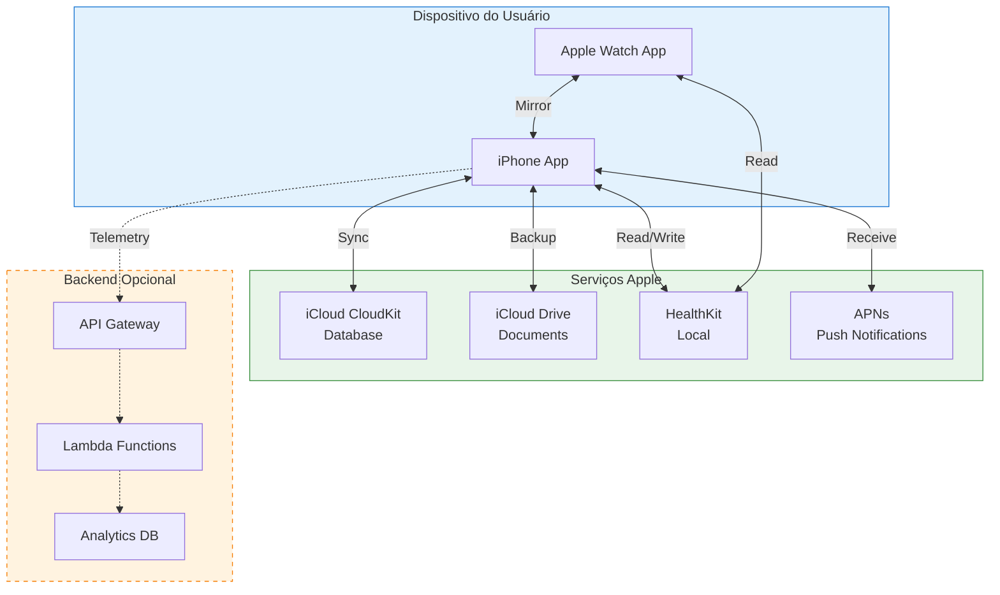

---

## 13. MODELO DE SEGURANÇA E PRIVACIDADE

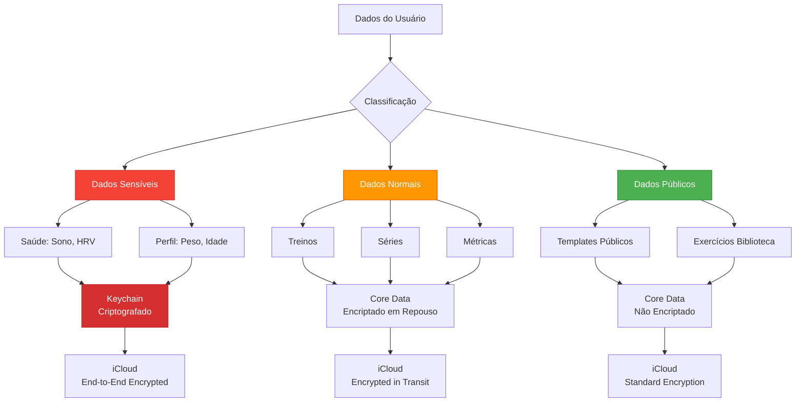

---

## 14. MÉTRICAS DE PERFORMANCE DO SISTEMA

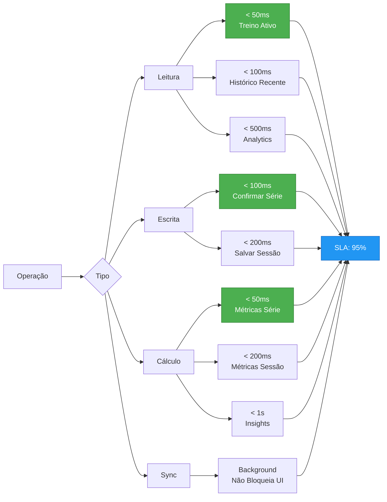

---

## 15. ESTRATÉGIA DE TESTES

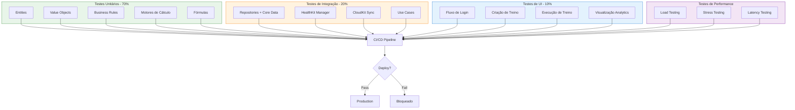

---

*Última atualização: 2026-05-19*
